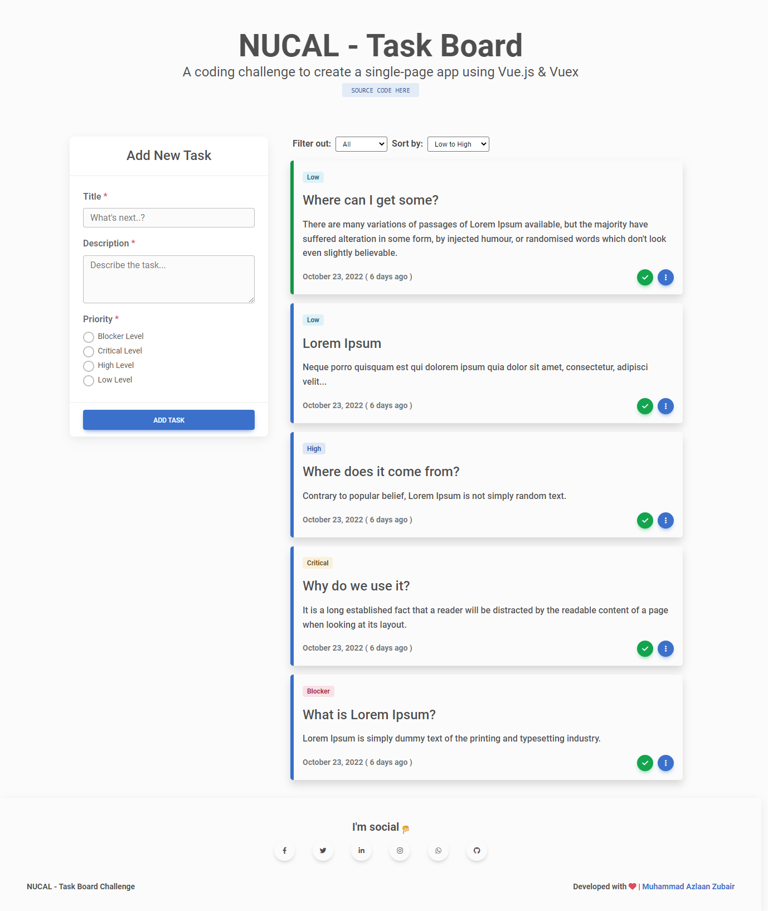
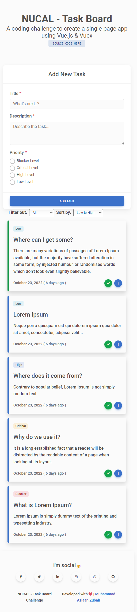

## NUCAL - Task Board Challenge

The coding challenge is to create a Single-Page App (SPA) within one week using Vue.js, Vuex for the frontend, and a back-end service.

## Progress

Since I am new to Vue Stack so I invested whole week to learn Vue JS and State Management with Vuex. Finally, spending whole week I've created the SPA [**check it out**](https://nucal-task-board-challenge.netlify.app/)!  

Unfortunatly, this SPA lacks following features that are required in the coding challenge.
 
 1. **Nest Tasks** - It was my firt time using Vuex so state management of sub-tasks / nested tasks becomes tough for me. I tried to make nested tasks ([**sub-tasks commit**](https://github.com/mdazlaanzubair/nucal_challenge/commit/852f9462e982598e2b03f130f6ad29e214fa237e)) but got confused while sorting and filtering and debugging was killing the time, so I decided to skip it focus on implementing other functionalities.

 2. **Backend API** - It took me whole week to code [**this app**](https://nucal-task-board-challenge.netlify.app/), so didn't got time to  develop backend API. I planned to use **Node JS** and **MongoDB** for developing backend API, if I could've spare some time from learning Vue JS and frontend development.

## Approach

In order to grab some bascis of Vue JS and Vuex I used to dig alot. But the most I followed, are these tutorials i.e. [**Vuex**](https://www.youtube.com/watch?v=arhCOcxIUo4&list=PL4cUxeGkcC9i371QO_Rtkl26MwtiJ30P2&index=7) and **[Vue JS](https://www.youtube.com/watch?v=YrxBCBibVo0&list=PL4cUxeGkcC9hYYGbV60Vq3IXYNfDk8At1)**.

Further, my approach for the backend was straight, all the functionality of sorting, filtering works in frontend. 

However, backend is just used to store and update data, without any extra server-side logic in order to make the application reactive (like I did in my previous projects i.e. [**Random Thoughts**](https://github.com/mdazlaanzubair/random-thoughts-backend) and [**Contact App**](https://github.com/mdazlaanzubair/Contact-App-API)).  
 
## App Preview

Want to see it live? [**Click here**](https://nucal-task-board-challenge.netlify.app/). Also, take a look at my [**Github**](https://github.com/mdazlaanzubair).

#### Desktop View

#### Mobile View

